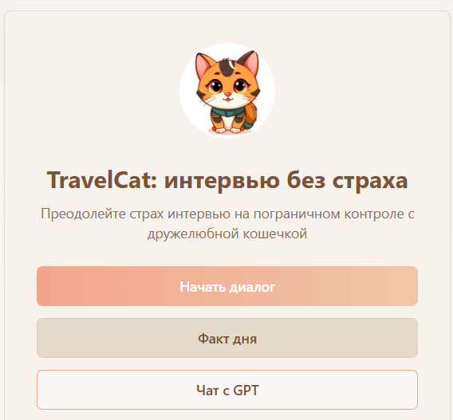
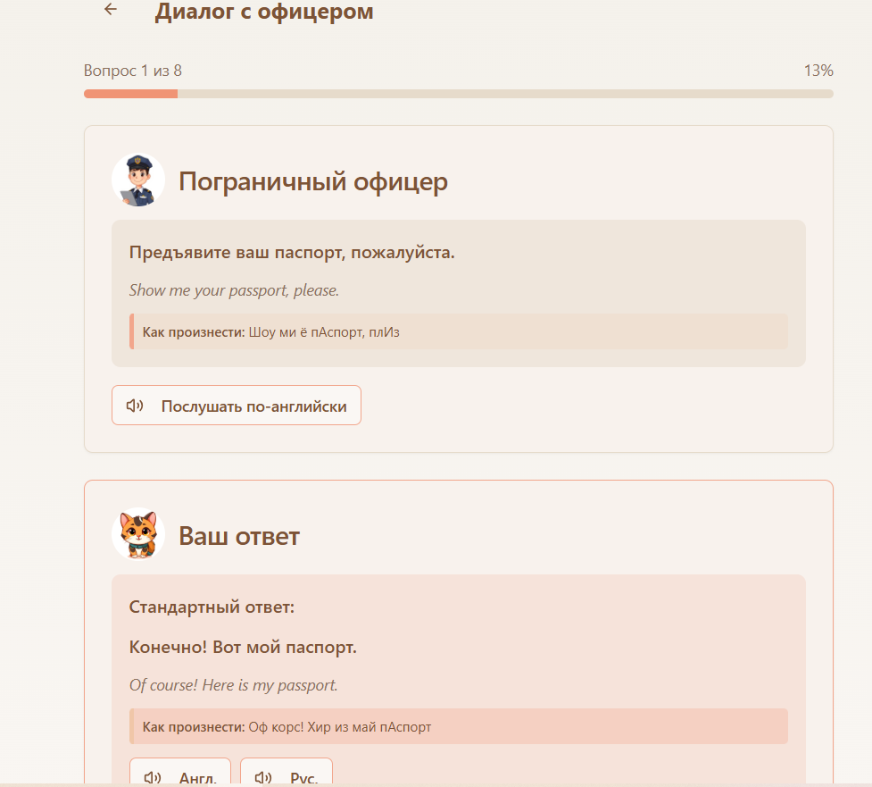
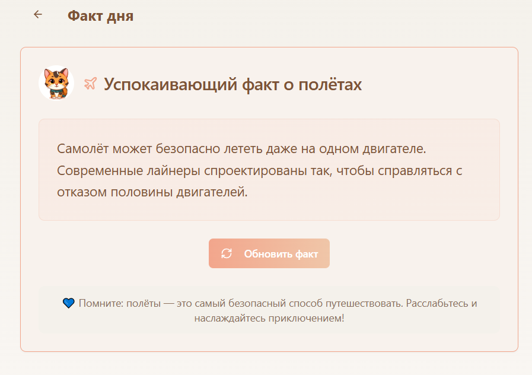

# 🐾 TravelCat App  

**TravelCat** — моё первое учебное приложение, сделанное на [Lovable](https://lovable.dev).  
Оно помогает тренироваться проходить погранконтроль в игровой форме:  
трёхцветная кошечка общается с офицером, отвечает на вопросы и получает поддержку.  

## ✈️ Функции
- Диалоги: вопросы на русском и английском + озвучка.  
- Кнопки: «Следующий вопрос», «Предыдущий вопрос», «Послушать фразу».  
- Прогресс-бар — показывает, сколько вопросов пройдено.  
- Раздел **Факт дня** — успокаивающие факты о перелётах.  
- Чат с GPT — можно спросить о путешествиях или новостях.  

## 🌟 Ссылка на прототип
[Открыть TravelCat](https://travelcat.lovable.app/)  

## 🔮 Планы на будущее
- Добавить больше фактов в раздел «Факт дня».  
- Улучшить дизайн (иконка кошечки и офицера).  
- Сделать возможность сохранять прогресс.  
## 🖼️ Превью

  
  
  

